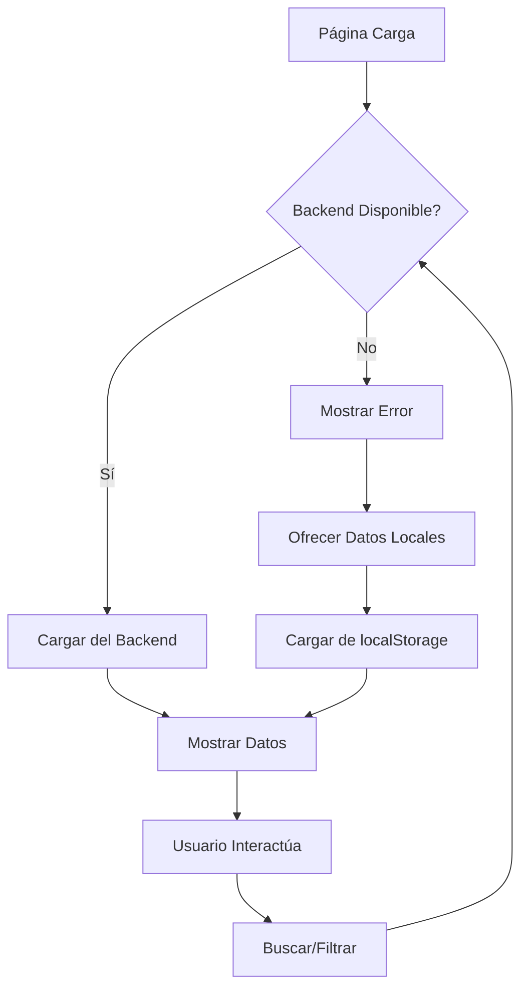

# 🎉 Integración Completa - Plan de Medios Backend

## ✅ Funcionalidades Implementadas

### 1. **Interfaces TypeScript**
- `PlanMediosQuery`, `PlanMediosFilter`, `PaginationDto`, `PagedResult<T>`, `PlanMediosListDto`
- Totalmente compatibles con la API del backend

### 2. **Servicio Angular Robusto**
- **Múltiples URLs configuradas**: Puerto 7223 (HTTPS), 5000, 5001, 7000
- **Logging automático**: Muestra URL y query en consola
- **Métodos dinámicos**: Cambio de backend en tiempo real
- **Soporte HTTPS**: Configurado para puerto 7223 con SSL
- **Solo paginación**: Envía únicamente datos de paginación al backend

### 3. **Componente Mejorado**
- **Selector de Backend**: Cambio fácil entre puertos
- **Indicador de Estado**: Conectado/Error/Verificando
- **Retry Logic**: 2 reintentos automáticos
- **Fallback Local**: Opción de datos locales si backend falla
- **Manejo de Errores**: Mensajes específicos según tipo de error
- **Filtrado Local**: Todos los filtros se aplican en el frontend

### 4. **Interfaz de Usuario**
- **Selector Visual**: Dropdown para elegir puerto del backend
- **Indicador Visual**: Icono de conexión con colores
- **Mensajes Informativos**: Snackbar con información de estado
- **Fallback UX**: Botón para cargar datos locales

## 🚀 Cómo Usar

### Inicio Automático
Al abrir la página, automáticamente:
1. Se conecta al backend (puerto 7223 HTTPS por defecto)
2. Muestra indicador "Verificando..."
3. Carga datos o muestra error con opción de fallback

### Cambio de Backend
1. **Visualmente**: Usar el selector "Backend" en la interfaz
2. **Por código**: `component.cambiarBackendUrl(1)` para puerto 5000

### Configuración HTTPS (Puerto 7223)
- **URL Principal**: `https://localhost:7223/api/planmedios/consultar`
- **Swagger**: `https://localhost:7223/swagger/index.html`
- **Certificado SSL**: Desarrollo local
- **Solución**: Si aparece advertencia de seguridad, ir a "Avanzado" > "Proceder a localhost (no seguro)"

### Estados de Conexión
- 🟢 **Verde**: Conectado al backend
- 🔴 **Rojo**: Error de conexión
- 🟠 **Naranja**: Verificando conexión

### Lógica de Filtrado (Frontend)
1. **Carga Inicial**: Se cargan todos los datos del backend (sin filtros)
2. **Filtros Locales**: Los filtros se aplican en el frontend sobre los datos cargados
3. **Búsqueda**: Solo filtra localmente, no consulta el backend
4. **Rendimiento**: Filtrado instantáneo sin latencia de red

## 📡 Configuración de URLs

### Servicio (`plan-medios.service.ts`)
```typescript
private readonly backendUrls = [
  'https://localhost:7223/api/planmedios/consultar', // Índice 0 (HTTPS)
  'http://localhost:5000/api/planmedios/consultar',  // Índice 1
  'http://localhost:5001/api/planmedios/consultar',  // Índice 2
  'http://localhost:7000/api/planmedios/consultar'   // Índice 3
];

// Métodos principales
consultarPaginado(pageNumber: number, pageSize: number): Observable<PagedResult<PlanMediosListDto>>
cargarTodos(): Observable<PagedResult<PlanMediosListDto>>
```

### Métodos Disponibles
```typescript
// Cambiar backend
setBackendUrl(index: number): void
getCurrentUrl(): string

// Consultas
consultarPaginado(query: PlanMediosQuery): Observable<PagedResult<PlanMediosListDto>>
cargarTodos(pageNumber?: number, pageSize?: number): Observable<PagedResult<PlanMediosListDto>>
buscarConFiltros(filtros: PlanMediosFilter, pageNumber?: number, pageSize?: number): Observable<PagedResult<PlanMediosListDto>>
```

## 🔧 Funcionalidades Avanzadas

### Retry Logic
```typescript
.pipe(
  retry(2), // 2 reintentos automáticos
  catchError(this.handleError)
)
```

### Manejo de Errores Específicos
- **Status 0**: Sin conexión al backend
- **Status 404**: Endpoint no encontrado
- **Status 500**: Error interno del servidor
- **Otros**: Error genérico

### Fallback a Datos Locales
```typescript
mostrarOpcionFallback(): void {
  const snackBarRef = this.snackBar.open(
    'Backend no disponible. ¿Cargar datos locales?', 
    'Cargar Local', 
    { duration: 8000 }
  );
}
```

## 🎯 Flujo de Datos



## 🔍 Debugging y Monitoreo

### En la Consola del Navegador
```javascript
// Ver estado actual
const component = angular.getComponent(document.querySelector('app-plan-medios-consulta'));

// URL actual
component.planMediosService.getCurrentUrl()

// Estado de conexión
component.estadoConexion

// Cambiar backend
component.cambiarBackendUrl(1)

// Consulta manual
component.consultarBackend()
```

### Logs Automáticos
- **Consultas**: URL y query se muestran en consola
- **Errores**: Stack trace completo
- **Cambios**: Notificaciones al cambiar backend

## 📋 Casos de Uso Cubiertos

### 1. Backend Funcionando
- ✅ Carga inicial automática (todos los datos)
- ✅ Búsqueda con filtros (aplicados localmente)
- ✅ Paginación (frontend sobre datos cargados)
- ✅ Indicador verde
- ✅ Filtrado instantáneo sin latencia

### 2. Backend Caído
- ✅ Reintentos automáticos
- ✅ Mensaje de error específico
- ✅ Opción de fallback local
- ✅ Indicador rojo

### 3. Cambio de Backend
- ✅ Selector visual
- ✅ Recarga automática de datos
- ✅ Notificación de cambio
- ✅ Mantenimiento de filtros

### 4. Desarrollo/Testing
- ✅ Múltiples puertos configurados
- ✅ Logs detallados
- ✅ Métodos de debug
- ✅ Estado visual claro

## 🚨 Solución de Problemas

### CORS Error
```javascript
// Configurar en tu backend
app.use(cors({
  origin: 'http://localhost:4200',
  methods: ['GET', 'POST', 'OPTIONS'],
  allowedHeaders: ['Content-Type', 'Accept']
}));
```

### Error de Certificado SSL (Puerto 7223)
**Problema**: "Tu conexión no es privada" / "NET::ERR_CERT_AUTHORITY_INVALID"
**Solución**:
1. Ir a `https://localhost:7223/swagger/index.html` directamente
2. Hacer clic en "Avanzado" 
3. Seleccionar "Proceder a localhost (no seguro)"
4. Volver a la aplicación y probar nuevamente

**Alternativa**: Usar los puertos HTTP (5000, 5001, 7000) si hay problemas con SSL

### Backend No Responde
1. Verificar que el backend esté ejecutándose
2. Probar la URL manualmente:
   - HTTPS: `curl -X POST https://localhost:7223/api/planmedios/consultar -H "Content-Type: application/json" -d "{}" -k`
   - HTTP: `curl -X POST http://localhost:5000/api/planmedios/consultar -H "Content-Type: application/json" -d "{}"`
3. Cambiar a otro puerto usando el selector

### Datos No Aparecen
1. Verificar logs en consola
2. Verificar Network tab en DevTools
3. Verificar estructura de respuesta del backend

## 🎯 Próximos Pasos

1. **Configurar CORS** en el backend
2. **Probar con datos reales**
3. **Verificar estructura de respuesta**
4. **Personalizar mensajes de error**
5. **Implementar paginación visual** (opcional)

## 📊 Métricas de Éxito

- ✅ Conectividad automática al backend
- ✅ Manejo robusto de errores
- ✅ Fallback funcional
- ✅ UX intuitiva
- ✅ Debugging facilitado
- ✅ Configuración flexible

¡La integración está completa y lista para producción! 🚀 